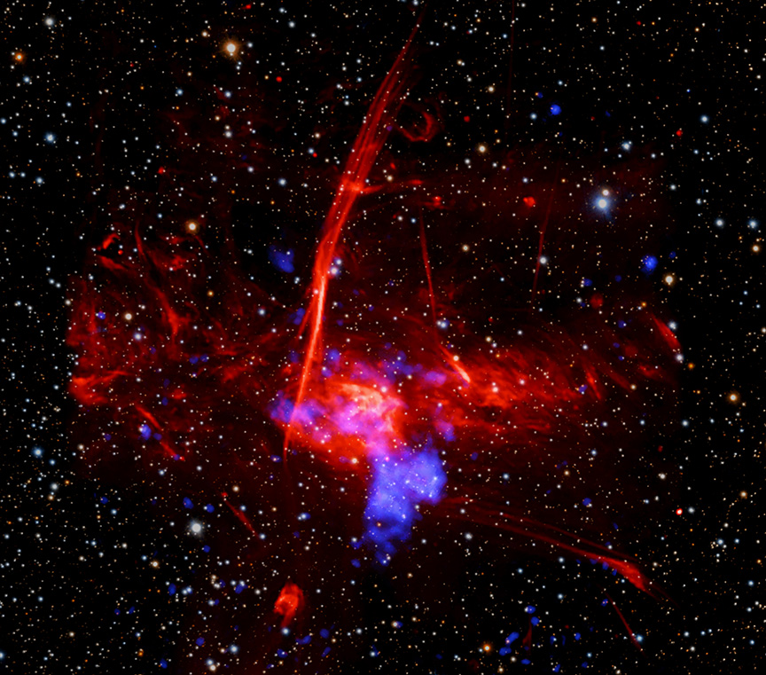

    #  NASA Astronomy Picture of the Day

    Date: 2026-06-18

     Possible Supernova Remnant in Galactic Center

    
    Do you see that blue blob to the lower right of the image center?   Astronomers think that it shows where a massive star exploded as a supernova whose light reached Earth 1,700 years ago.   The image combines optical data from the PanSTARRS telescopes in Hawaii (background stars in red, green, and blue), radio from the MeerKAT telescope in South Africa (large red cloud) and X-rays from NASA's Chandra X-ray Observatory and ESA’s XMM-Newton (shown in blue).   The large cloud is a star forming region called Sagittarius C, which is approximately 50 light-years in extent and about 26,000 light-years from Earth.   It is located only about 260 light-years from the supermassive black hole in the center of the Galaxy (off to the left of the image).   If the blue blob is confirmed to be a supernova remnant, it would be one of the closest ever discovered to the Galactic Center.   In this dense region, the deaths of massive stars are connected to the birth of new stars through gas and magnetic fields in a complex way.

    Image credit: NASA APOD
        