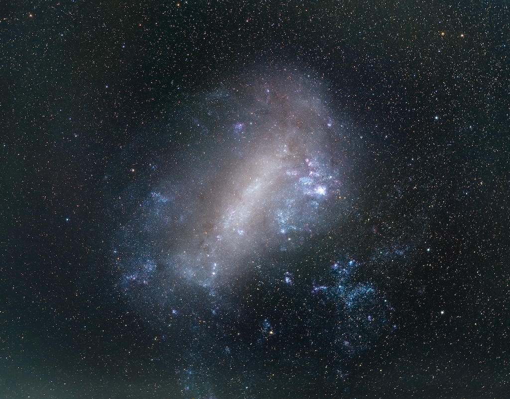

    #  NASA Astronomy Picture of the Day

    Date: 2026-07-23

     The Large Magellanic Cloud

    
    Have you ever seen another galaxy with your own eyes?   The featured image shows the Large Magellanic Cloud (LMC), one of the closest neighbors of our Milky Way.     If you are anywhere south of latitude 20° N (but the further south, the better), you can see it with the unaided eye if you go to a dark sky location, away from big cities and light polution.   It is a dwarf irregular galaxy about 163,000 light-years away, and a member of our Local Group of galaxies.   Despite being small, with a total mass approximately equivalent to 10% - 20% of the mass of the Milky Way, the LMC is very actively forming stars.   This is likely due in part to the gravitational push and pull of tides caused by the Milky Way on the LMC.   Some astronomers have predicted that it will collide with the Milky Way in in about 2 billion years.

    Image credit: NASA APOD
        