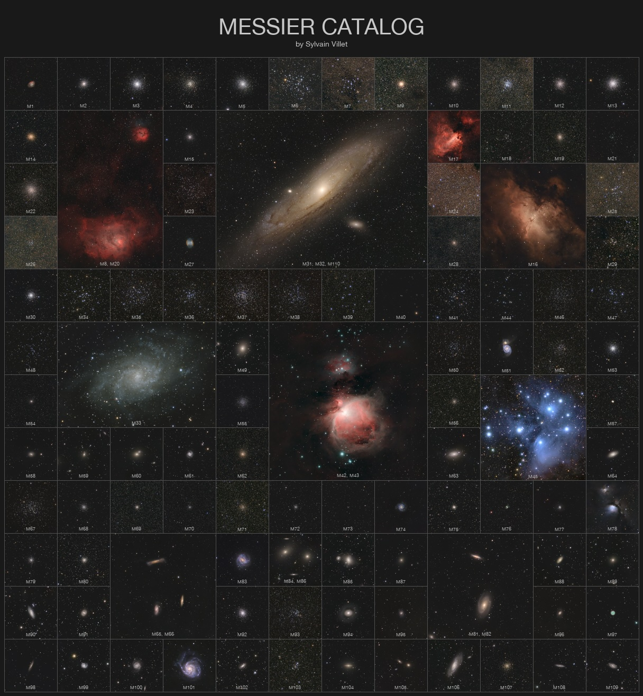

    #  NASA Astronomy Picture of the Day

    Date: 2026-05-14

     Messier Catalog at Uniform Scale

    
    What are some of the most interesting astronomical objects you can see in the night sky?   Armed with a good pair of binoculars or a small telescope, if you live in the Northern Hemisphere, you can look for the very popular objects in the Messier Catalog.   Most of them, but not all, are also visible from the southern half of the Earth.   The featured image shows all 110 objects in the catalog at uniform scale -- the same magnification.   Charles Messier created the catalog in the 18th century.   He was interested in comets, and his catalog was a list of known comet-like "objects to avoid" in the sky when observing or hunting for comets.   The deep sky objects in the catalog include a supernova remnant (the Crab Nebula, M1), other galaxies (such as Andromeda, M31), nebulae (e.g. the Orion Nebula, M42, a star-forming region) and stellar clusters (such as the Pleiades, M45, a bright young open cluster).

    Image credit: NASA APOD
        