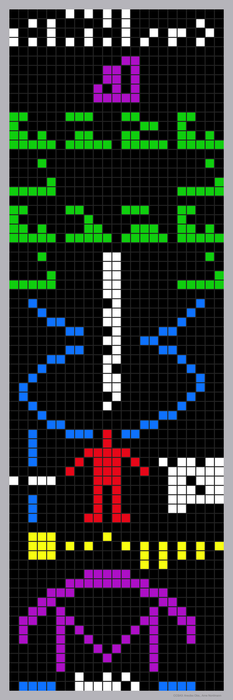

    #  NASA Astronomy Picture of the Day

    Date: 2026-03-29

     A Message from Earth

    
    What are these Earthlings trying to tell us?  The featured message was broadcast from Earth towards the globular star cluster M13 in 1974.  During the dedication of an upgrade to the Arecibo Observatory - then the largest single radio telescope in the world - a string of 1's and 0's representing the diagram was sent.  This attempt at extraterrestrial communication was mostly ceremonial - humanity regularly broadcasts radio and television signals out into space accidentally.  Even were this message received, M13 is so far away we would have to wait almost 50,000 years to hear an answer.  The featured message gives a few simple facts about humanity and its knowledge: from left to right are numbers from one to ten, atoms including hydrogen and carbon, some interesting molecules, DNA, a human with description, basics of our Solar System, and basics of the sending telescope.  Several searches for extraterrestrial intelligence are currently underway.   Explore the Universe: Random APOD Generator

    Image credit: NASA APOD
        