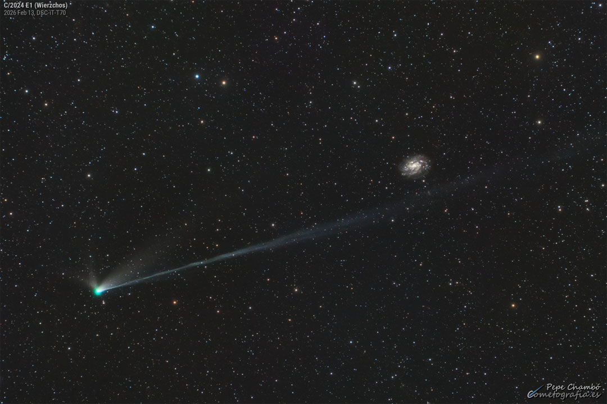

    #  NASA Astronomy Picture of the Day

    Date: 2026-02-17

     Tails of Comet Wierzchoś

    
    Some comets are regular guests of our solar neighborhood; others come by only once, never to return.  We won’t have another chance to see Comet C/2024 E1 (Wierzchoś), which is currently making its way through the inner Solar System.  The hyperbolic orbit of this comet indicates that it will likely become an interstellar traveler.  Comet Wierzchoś is today near its closest approach to the Earth, passing roughly the same distance from the Earth as is the Sun.  The featured 30-minute exposure was taken last week in Chile and shows a 5-degree long ion tail as well as three shorter dust tails.  The green hue of the coma comes from the breakdown of dicarbon molecules by sunlight, but that process does not last long enough to also tinge the tails.  On the far right lies a spiral galaxy far in the distance: NGC 300.

    Image credit: NASA APOD
        