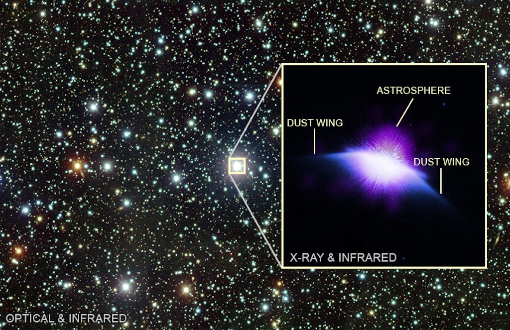

    #  NASA Astronomy Picture of the Day

    Date: 2026-03-06

     The Astrosphere of HD 61005

    
    Do young stars blow bubbles? The larger view shows a stellar field observed with the Cerro Tololo Inter-American Observatory in Chile, and the inset highlights HD 61005, a star like our Sun, only 120 light-years away. Much younger than the Sun, at just about 100 million years old, it blows a fast and dense stellar wind that pushes out the cooler dust and gas that surrounds it, forming a bubble called an astrosphere. The star-blown bubble was detected with the Chandra X-ray Observatory, and it has a diameter roughly 200 times the Earth-Sun distance.  Our Sun has a bubble too, called the heliosphere, which protects the planets from cosmic radiation. Also shown in the inset is debris left behind from star formation, observed by Hubble. The debris appears as wings, giving the star its nickname: the Moth.

    Image credit: NASA APOD
        