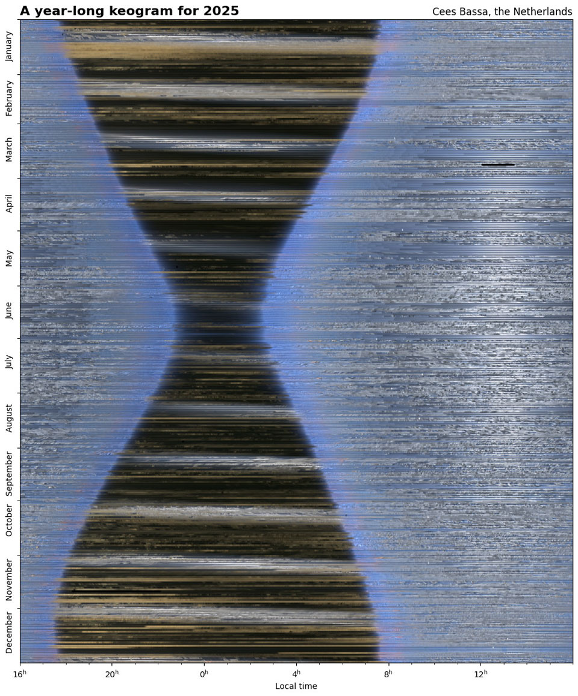

    #  NASA Astronomy Picture of the Day

    Date: 2026-06-21

     Keogram: The Sky in 2025

    
    What if you could see the entire sky -- all at once -- for an entire year? That, very nearly, is what is pictured here.  Every 15 seconds during 2025, an all-sky camera took an image of the sky over the Netherlands. Central columns from these images were then aligned and combined to create the featured keogram, with January at the top, December at the bottom, and the middle of the night running vertically just left of center. What do we see?  Most obviously, the daytime sky is mostly blue, while the nighttime sky is mostly black.  The twelve light bands crossing the night sky are caused by the glow of the Moon. The thinnest part of the black hourglass shape occurs during the summer solstice, like today, when days are the longest, while the thickest part occurs at the winter solstice. Equinoxes can also be located in the keogram, for example the northern-spring equinox from one year ago is about three-quarters of the way up.

    Image credit: NASA APOD
        