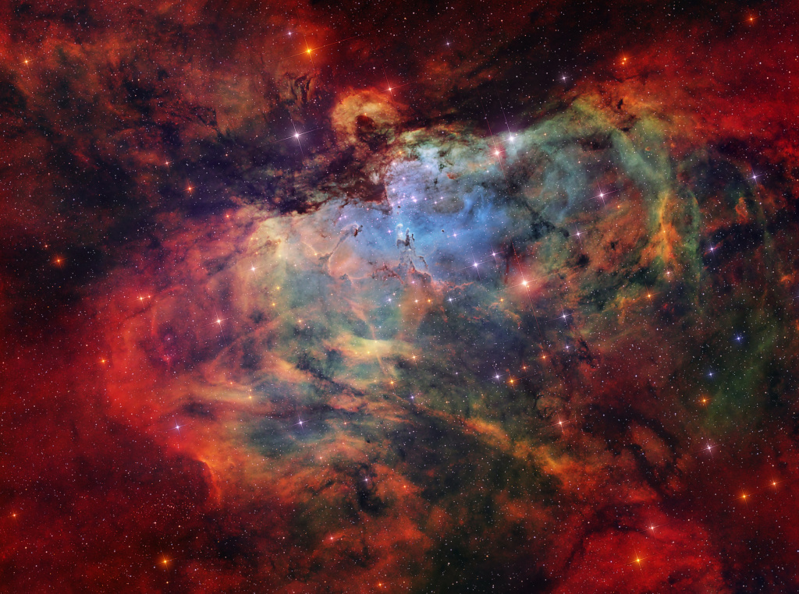

    #  NASA Astronomy Picture of the Day

    Date: 2026-06-10

     The Eagle Nebula and Friends

    
    What looks as if it is going to swallow the great Pillars of Creation? The Eagle Nebula (M16) is not a bird, a plane, or Superman. M16 is actually a combination of several celestial objects. NGC 6611 is the young star cluster that appears to peak out beneath the Eagle’s “wings”. The ultraviolet light from these stars ionizes the surrounding gas, creating the emission nebula IC 4703. The Stellar Spire is seen reaching towards the Pillars of Creation from the left. Both are structures of cold gas and dust that are optimal for star formation. Some astronomers previously thought the Pillars of Creation had been evaporated away by a supernova. Because M16 is 6,000 light years away, we would not be able to see the Pillars’ destruction for thousands more years. However, there is no conclusive evidence of the theorized supernova, so the Pillars of Creation will likely continue to create stars for millions of years.

    Image credit: NASA APOD
        