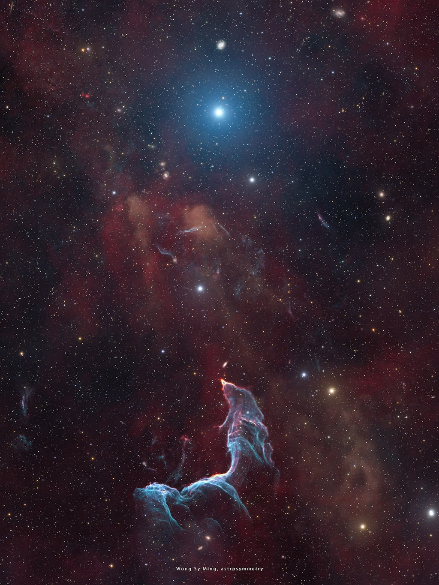

    #  NASA Astronomy Picture of the Day

    Date: 2026-06-11

     The Mermaid Nebula Supernova Remnant

    
    Could the Little Mermaid turn into stardust instead of seafoam?   It would seem so in this beautiful nebula.   The featured image shows the Mermaid Nebula, also known as the Betta Fish Nebula, which is part of the G296.5+10.0 Supernova Remnant.   The blue color visible here originates from doubly ionized oxygen (OIII), while the deep red is emitted by hydrogen gas.   												 Estimated to be located a few thousand light-years away and about 10,000 years old, this nebula was formed when a massive star exploded as a supernova. 												 It left behind a peculiar pulsar, a young radio-quiet neutron star that spins around about twice every second.   The bright stars shown in the image are unassociated with the nebula.												   The pulsar can be detected in the X-rays but it does not have a confirmed detection in the optical (visible light) so far.   As a result, the pulsar itself is not visible in this image.

    Image credit: NASA APOD
        