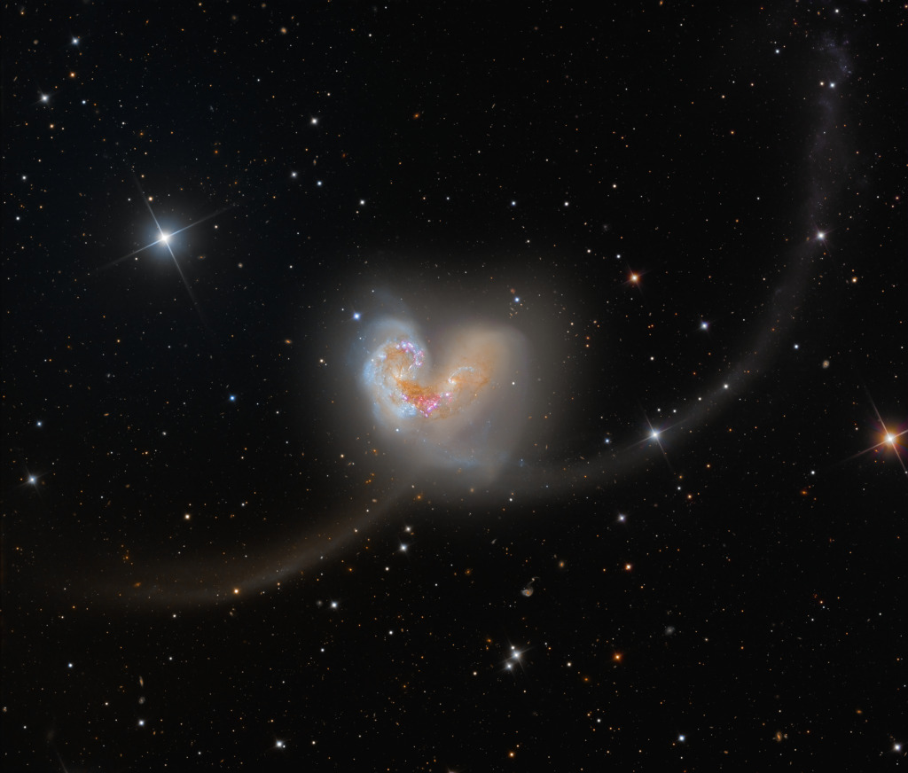

    #  NASA Astronomy Picture of the Day

    Date: 2026-04-10

     Exploring the Antennae

    
    Some 60 million light-years away in the southerly constellation Corvus, two large galaxies are colliding. Stars in the two galaxies, cataloged as NGC 4038 and NGC 4039, very rarely collide in the course of the ponderous cataclysm that lasts for hundreds of millions of years. But the galaxies' large clouds of molecular gas and dust often do, triggering furious episodes of star formation near the center of the cosmic wreckage. Spanning over 50 thousand light-years, this stunning telescopic frame also reveals new star clusters and matter flung far from the scene of the accident by gravitational tidal forces. The remarkably sharp ground-based image follows the faint tidal tails and distant background galaxies in the field of view. The suggestive overall visual appearance of the extended arcing structures gives the galaxy pair, also known as Arp 244, its popular name - The Antennae.   Artemis II: mission updates

    Image credit: NASA APOD
        