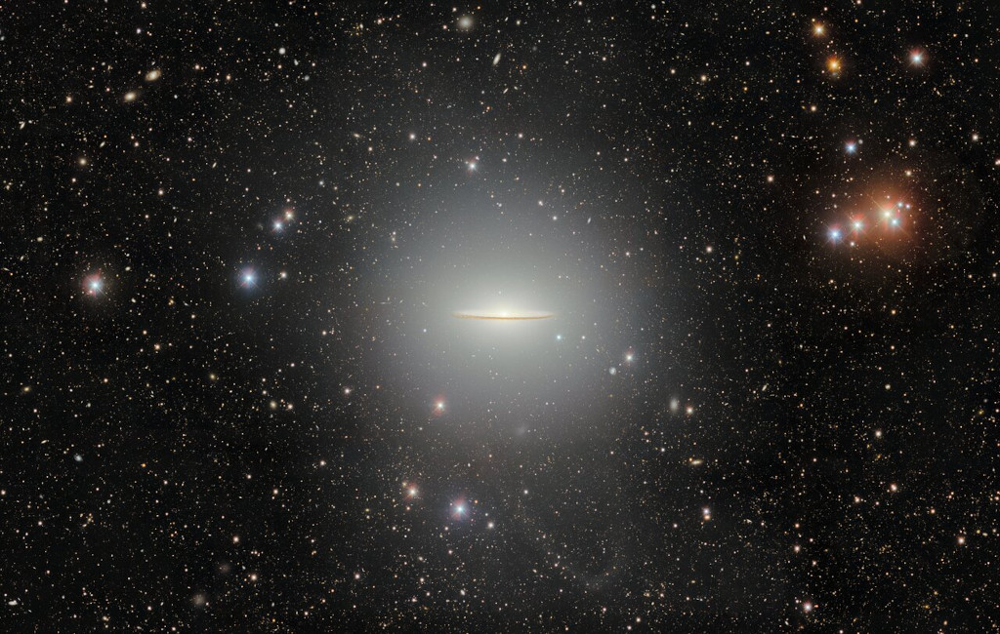

    #  NASA Astronomy Picture of the Day

    Date: 2026-05-29

     Messier 104

    
    A gorgeous spiral galaxy, Messier 104 is famous for its nearly edge-on profile featuring a broad ring of obscuring dust lanes. Seen in silhouette against an extensive central bulge of stars, the swath of cosmic dust lends a broad brimmed hat-like appearance to the galaxy suggesting a more popular moniker, the Sombrero Galaxy. Also known as NGC 4594, the Sombrero galaxy can be seen across the spectrum and is host to a central supermassive black hole. About 50,000 light-years across and 28 million light-years away, M104 is one of the largest galaxies at the southern edge of the Virgo Galaxy Cluster. Still, the spiky foreground stars in this field of view lie well within our own Milky Way. This broad view of the well-known galaxy was processed to reveal M104's extended halo, as well as a faint tidal stellar stream. It was captured by the Dark Energy Camera (DECam) on the Blanco 4-meter telescope at the Cerro Tololo Inter-American Observatory.

    Image credit: NASA APOD
        