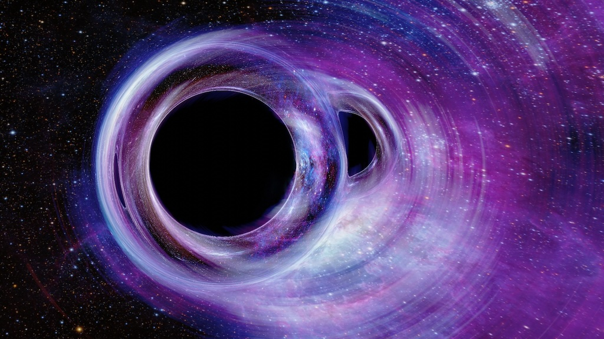

    #  NASA Astronomy Picture of the Day

    Date: 2026-04-03

     Caught in the Web: Visualization of a Black Hole Merger in the Tarantula Nebula

    
    How can we see what is invisible? Black holes are not easy to see in the dark cosmic night, but astronomers can find them by analyzing their gravitational effects on matter, light and spacetime. The featured image shows an illustration that combines a simulation of a black hole binary system in its final "death-dance" with an astrophotography image of the Tarantula Nebula in the background. Even though black holes don't emit light, they distort the path of light rays, acting like a gravitational lens. As a result, the nebula appears extremely distorted, forming Einstein rings and multiple images.  Tarantula Nebula lies in the Large Magellanic Cloud, a dwarf galaxy that is one of the satellite galaxies of the Milky Way, 160,000 light-years away. That is more than 1,000 times closer than any of the binary black hole mergers detected so far. We'll probably never detect a merger so close to home!

    Image credit: NASA APOD
        