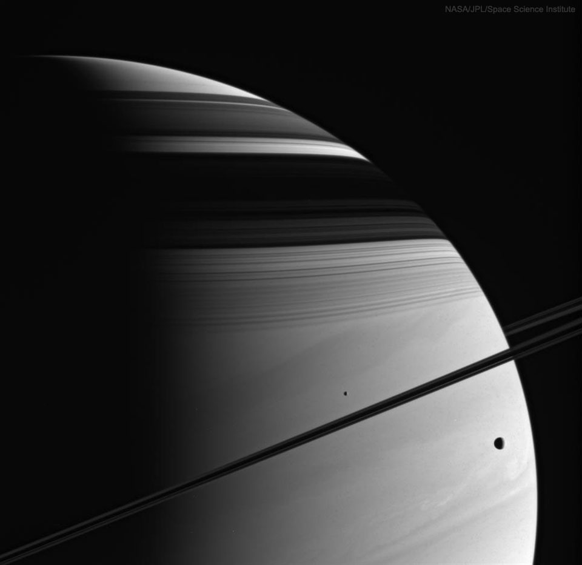

    #  NASA Astronomy Picture of the Day

    Date: 2026-06-16

     Moons, Rings, Shadows, Clouds: Saturn (Cassini)

    
    While cruising around Saturn, be on the lookout for picturesque arrangements of moons, rings, and shadows. One such striking sight occurred in 2005 and was captured by the then Saturn-orbiting Cassini spacecraft. In the featured image, moons Mimas (left) and Tethys (right) are visible on either side of Saturn's thin rings, which are seen nearly edge-on.  Across the top of Saturn are dark shadows of the wide rings, exhibiting their impressive complexity. The violet-light image brings up the texture of the backdrop: Saturn's clouds. Cassini orbited Saturn from 2004 until mid-2017, when the robotic spacecraft was directed to dive into Saturn to keep it from contaminating any moons.    Explore the Universe: Random APOD Generator

    Image credit: NASA APOD
        