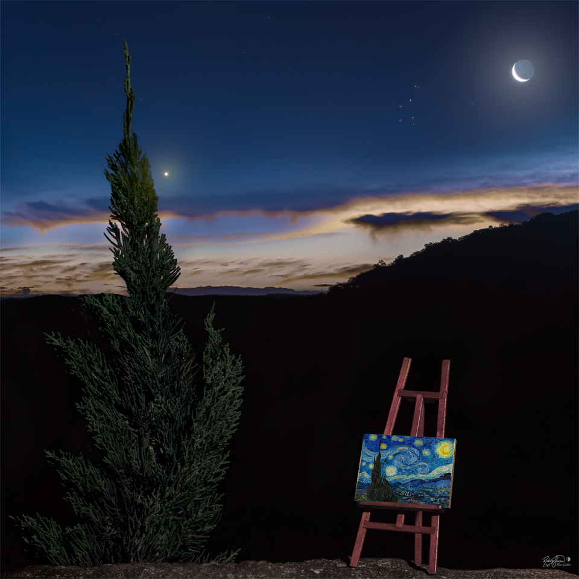

    #  NASA Astronomy Picture of the Day

    Date: 2026-06-19

     Starry Night II

    
    Does this scene look familiar? It is a modern recreation of the famous painting Starry Night by Vincent van Gogh.  Both the image and the painting depict a tall tree on the left, a crescent moon on the upper right, the planet Venus just to the right of the tree, a foreground horizon rising from left to right, and clouds above the horizon. Differences include that the photograph was taken in mid-April earlier this year in Cascavel, Brazil, while the painting was composed in Saint-Rémy-de-Provence, France, in 1889.  The original Starry Night is considered by many to be one of the three most famous paintings in the world today and a statement about the wonders of the night sky. Today is (roughly) the anniversary of the morning that van Gogh saw the sky that he later painted in his version of Starry Night.    Night Sky Jigsaw: Astronomy Puzzle of the Day

    Image credit: NASA APOD
        