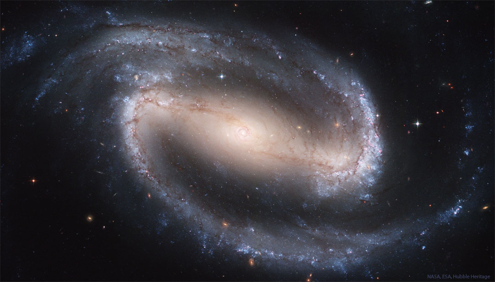

    #  NASA Astronomy Picture of the Day

    Date: 2026-05-17

     NGC 1300: Barred Spiral Galaxy

    
    Across the center of this spiral galaxy is a bar.  And at the center of this bar is smaller spiral.  And at the center of that spiral is a supermassive black hole.  This all happens in the big, beautiful, barred spiral galaxy cataloged as NGC 1300, a galaxy that lies some 70 million light-years away toward the constellation of the river Eridanus. This Hubble Space Telescope composite view of the gorgeous island universe is one of the most detailed Hubble images ever made of a complete galaxy.  NGC 1300 spans over 100,000 light-years and the Hubble image reveals striking details of the galaxy's dominant central bar and majestic spiral arms. How the giant bar formed, how it remains, and how it affects star formation remains an active topic of research.   Jigsaw Universe: Astronomy Puzzle of the Day

    Image credit: NASA APOD
        