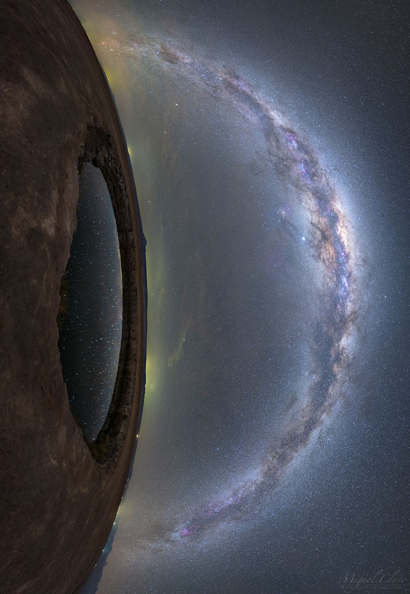

    #  NASA Astronomy Picture of the Day

    Date: 2026-04-19

     Eye on the Milky Way

    
    Have you ever had stars in your eyes? It appears that the eye on the left does, and moreover, it appears to be gazing at even more stars. The featured 27-frame mosaic was taken in 2019 from Ojas de Salar in the Atacama Desert of Chile.  The eye is actually a small lagoon captured reflecting the dark night sky as the Milky Way Galaxy arched overhead. The seemingly smooth band of the Milky Way is really composed of billions of stars, but decorated with filaments of light-absorbing dust and red-glowing nebulas. Additionally, both Jupiter (slightly left the galactic arch) and Saturn (slightly to the right) are visible.  The lights of small towns dot the unusual vertical horizon.  The rocky terrain around the lagoon appears to some more like the surface of Mars than our Earth.   Sky Surprise: What picture did APOD feature on your birthday? (after 1995)

    Image credit: NASA APOD
        