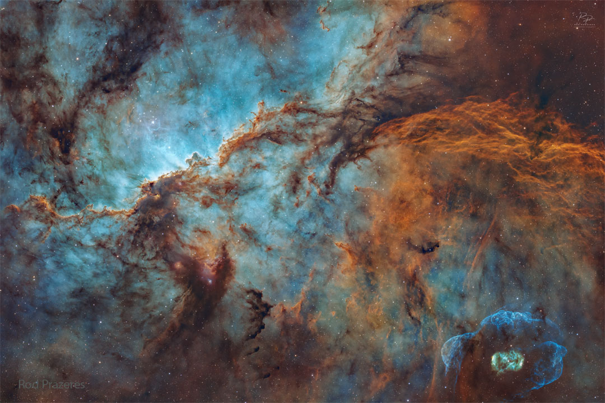

    #  NASA Astronomy Picture of the Day

    Date: 2026-07-07

     NGC 6188: Dragons of Ara

    
    Where can you find dragons fighting in the night sky?  In the southern constellation of the Altar: Ara. The dragons are, of course, actually made of suggestively shaped gas and dust.  The celestial home of the mythological battling beasts is cataloged as NGC 6188 and located about 4,000 light years away near the edge of a large molecular cloud.  Massive, young stars of the embedded Ara OB1 association were formed there only a few million years ago, sculpting the dark shapes and powering the nebular glow with stellar winds and intense ultraviolet radiation.  Joining NGC 6188 on this cosmic canvas, visible toward the lower right, is unusual emission nebula NGC 6164, also created by one of the region's massive stars.  This impressively wide field picture, captured from Queensland, Australia, spans over 2 degrees (four full Moons).

    Image credit: NASA APOD
        