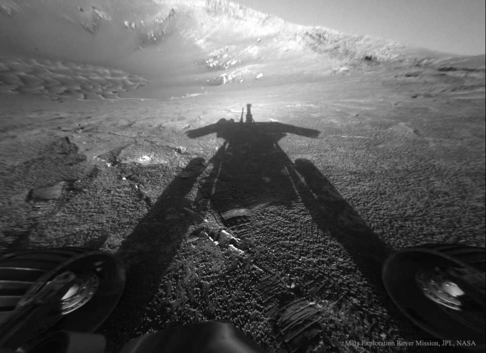

    #  NASA Astronomy Picture of the Day

    Date: 2026-02-22

     Shadow of a Martian Robot

    
    What if you saw your shadow on Mars and it wasn't human?  Then you might be the Opportunity rover exploring Mars.  Opportunity explored the Red Planet from 2004 to 2018, finding evidence of ancient water, and sending breathtaking images across the inner Solar System.  Pictured here in 2004, Opportunity looks opposite the Sun into Endurance Crater and sees its own shadow.  Two wheels are visible on the lower left and right, while the floor and walls of the unusual crater are visible in the background.  Caught in a dust storm in 2018, Opportunity stopped responding, and NASA stopped trying to contact it in 2019 and declared the ground-breaking mission, originally planned for only 92 days, complete.

    Image credit: NASA APOD
        