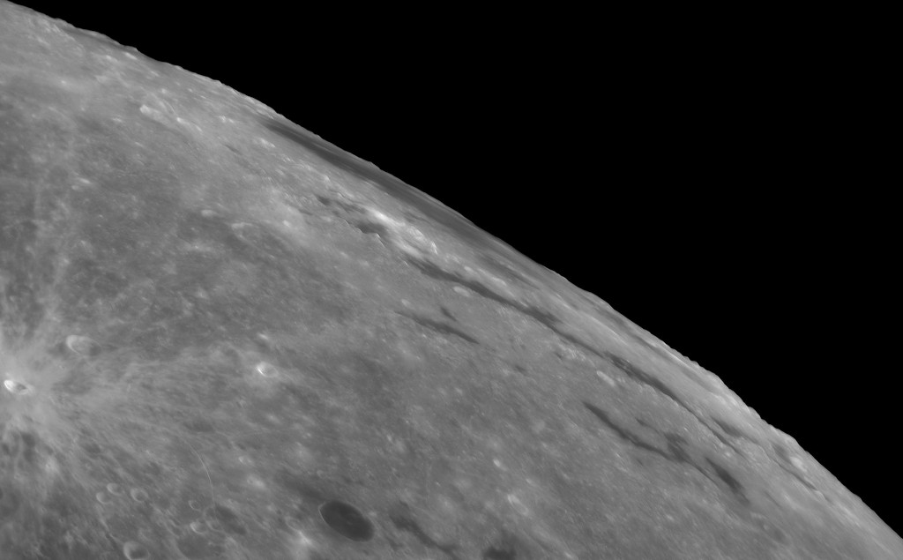

    #  NASA Astronomy Picture of the Day

    Date: 2026-07-10

     Western Moon, Eastern Sea

    
    The Mare Orientale, Latin for Eastern Sea, is one of the most striking large scale lunar features. The youngest of the large lunar impact basins it's very difficult to see from an earthbound perspective. Still, captured on July 7 during a period of favorable tilt, or libration of the lunar nearside, the Eastern Sea can be found at the upper right in this sharp telescopic view. In the image, the large lunar mare is extremely foreshortened and stretches along the Moon's western edge. Formed by the impact of an asteroid over 3 billion years ago and nearly 1000 kilometers across, the impact basin's concentric circular features are ripples in the lunar crust. But they are a little easier to spot in more direct images of the region taken from lunar orbit. So why is the Eastern Sea at the Moon's western edge? The Mare Orientale lunar feature was named before 1961. That's when the convention labeling east and west on lunar maps was reversed.

    Image credit: NASA APOD
        