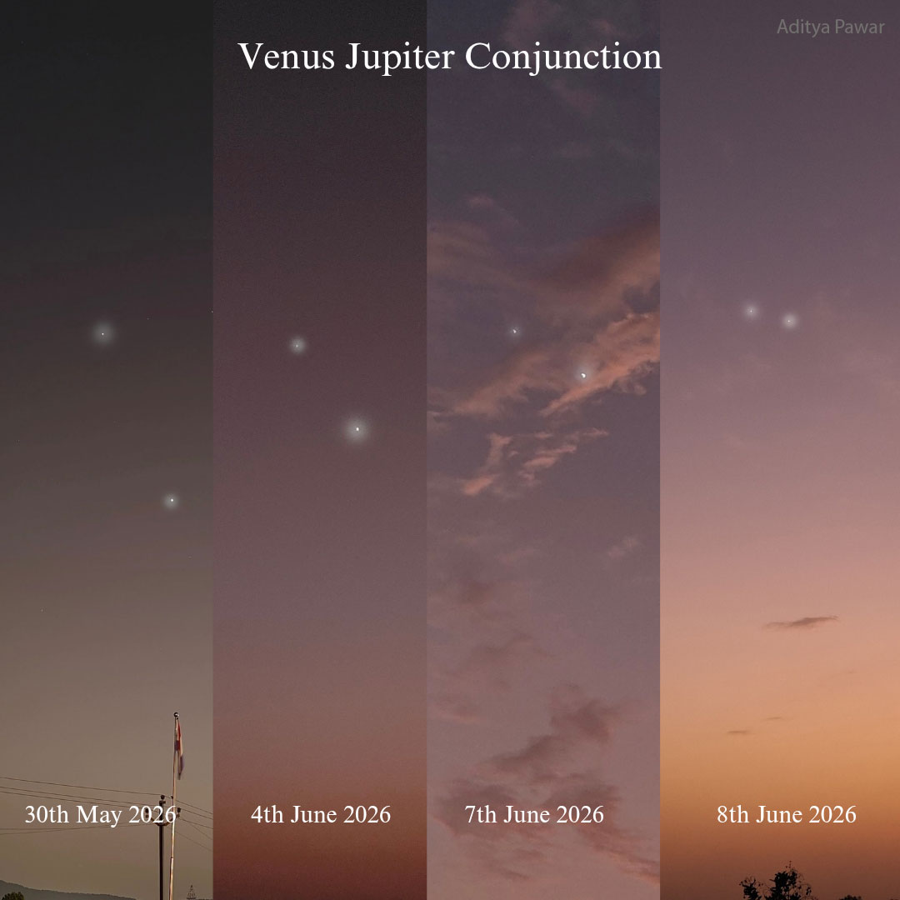

    #  NASA Astronomy Picture of the Day

    Date: 2026-06-14

     10 Days of Venus and Jupiter

    
    Venus and Jupiter may have caught your attention lately.  The  recent close conjunction of the two brightest planets in recent evening skies has been hard to miss. With Jupiter at the top, starting on May 30 and ending on June 8, their close approach was chronicled daily, left to right, in the featured panels from Maharashtra, India. Near the western horizon, the evening sky colors and exposures used for each panel depend on the local conditions near sunset. At their closest on June 9, the celestial pair appeared to be only about three times the width of a full moon apart. Of course, on that date, the two planets were physically separated by over 600 million kilometers in their orbits around the Sun. In the coming days, Jupiter will slowly settle into the sunset glare, but Venus will continue to move farther from the Sun in the western sky to excel in its current role as the brilliant evening star.   Gallery: Venus - Jupiter Conjunction of 2026 June

    Image credit: NASA APOD
        