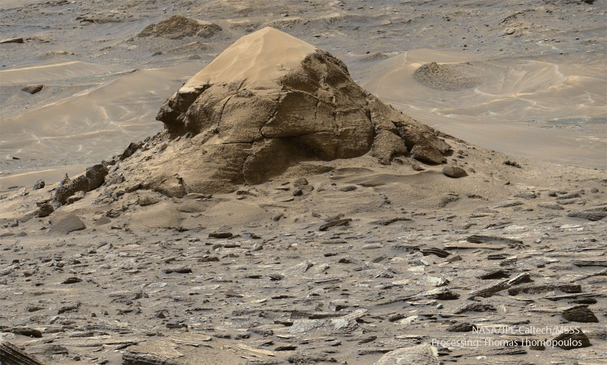

    #  NASA Astronomy Picture of the Day

    Date: 2026-07-21

     Turtle Rock on Mars

    
    Is this a fossilized turtle on Mars?  No.  Although resembling a large Earth tortoise, this is a layered rock outcrop on Mars that is estimated to span about 15 meters, making it much larger than turtles on Earth. NASA’s robotic Curiosity rover came across this unusual mound, dubbed Miraflores, last month during its 4922nd Martian day exploring Mars.  The small butte may survive because it was somehow more resistant to erosion than surrounding rock.  More recent wind has now covered its top with orange Martian sand.  Below the top shell, many layers of stratified rock are visible, possibly indicating a long history of intermittent wind-blown sand being deposited and then hardened by ground water.  Similar wind-eroded layered landforms, such as yardangs in the Qaidam Desert of China, exist here on Earth. Curiosity and its companion rover Perseverance continue to investigate the ancient history of Mars as well as searching for signs of primeval life.

    Image credit: NASA APOD
        