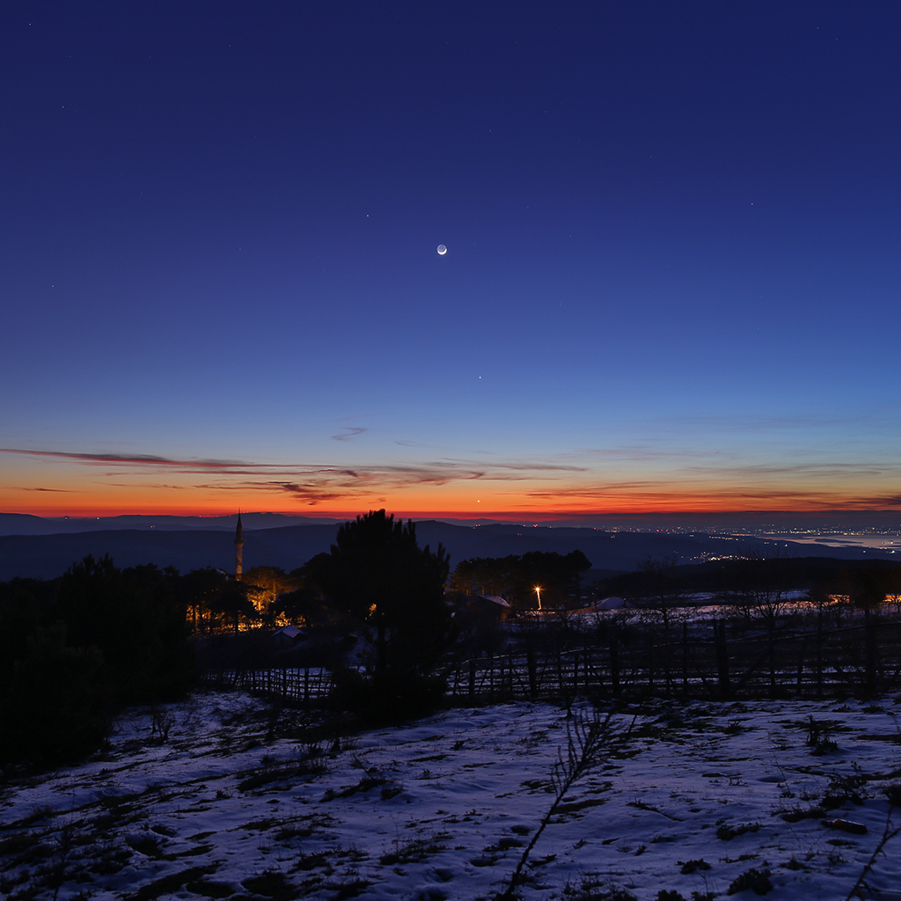

    #  NASA Astronomy Picture of the Day

    Date: 2026-02-21

     Twilight with Moon and Planets

    
    Only two days after the February New Moon's annular eclipse of the Sun, a slender lunar crescent poses above the western horizon after sunset in this wintry twilight skyscape. Its nightside faintly illuminated by earthshine, the young Moon is joined by three bright planets in the mostly clear, early evening skies above the village of Kirazli, Turkiye. Inner planet Venus appears closest to the horizon. Near the beginning of its 2026 performance as planet Earth's evening star, brilliant Venus is seen through the warm sunset glare near picture center. Straight above Venus, innermost planet Mercury is easy to spot as it stands remarkably high above the horizon even as the twilight sky is growing dark. Outer planet Saturn, most distant of the naked-eye planets, is found just left of the Moon's sunlit crescent.

    Image credit: NASA APOD
        