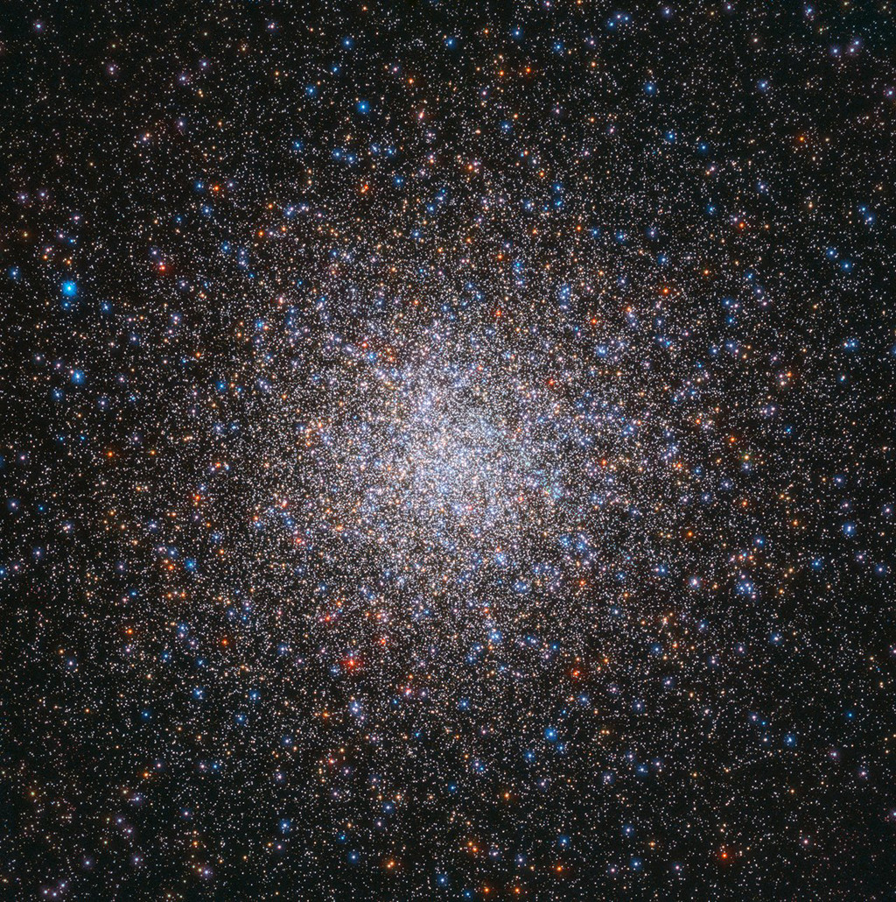

    #  NASA Astronomy Picture of the Day

    Date: 2026-05-23

     Messier 2

    
    After the Crab Nebula, this giant star cluster is the second entry in 18th century astronomer Charles Messier's famous list of things that are not comets. M2 is one of the largest globular star clusters now known to roam the halo of our Milky Way galaxy. Though Messier originally described it as a nebula without stars, this stunning Hubble image resolves stars across the cluster's central 40 light-years. Its population of stars numbers close to 150,000, concentrated within a total diameter of around 175 light-years. About 55,000 light-years distant toward the constellation Aquarius, this ancient denizen of the Milky Way, also known as NGC 7089, is 13 billion years old. An extended stellar debris stream, a signature of past gravitational tidal disruption, was recently found to be associated with Messier 2.

    Image credit: NASA APOD
        