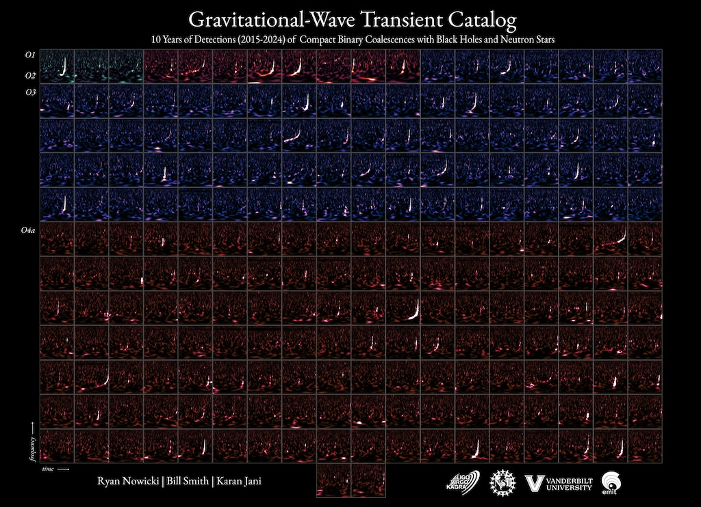

    #  NASA Astronomy Picture of the Day

    Date: 2026-03-26

     Black Holes and Neutron Stars: 218 Mergers and Counting

    
    What is the sound of two black holes merging in deep space? Sound waves don't propagate in vacuum, but gravitational waves do. In 2015 we were able to "hear" them for the first time and confirm one of Albert Einstein's theoretical predictions. Each square on the grid of the featured image represents one of the gravitational wave detections announced so far by the LIGO-VIRGO-KAGRA Collaboration. These plots show how the binary pair accelerates in their orbit around each other towards merger: the rising frequency effect is called a "chirp". Although there are significantly more neutron stars than black holes, most of the detections are binary black hole mergers. That happens because black holes are heavier and their signals are louder and can be seen farther away, resulting in more detections. These events are rare, and we don't expect to see one close by in our Galaxy any time soon. But they are happening continuously throughout the cosmos.

    Image credit: NASA APOD
        