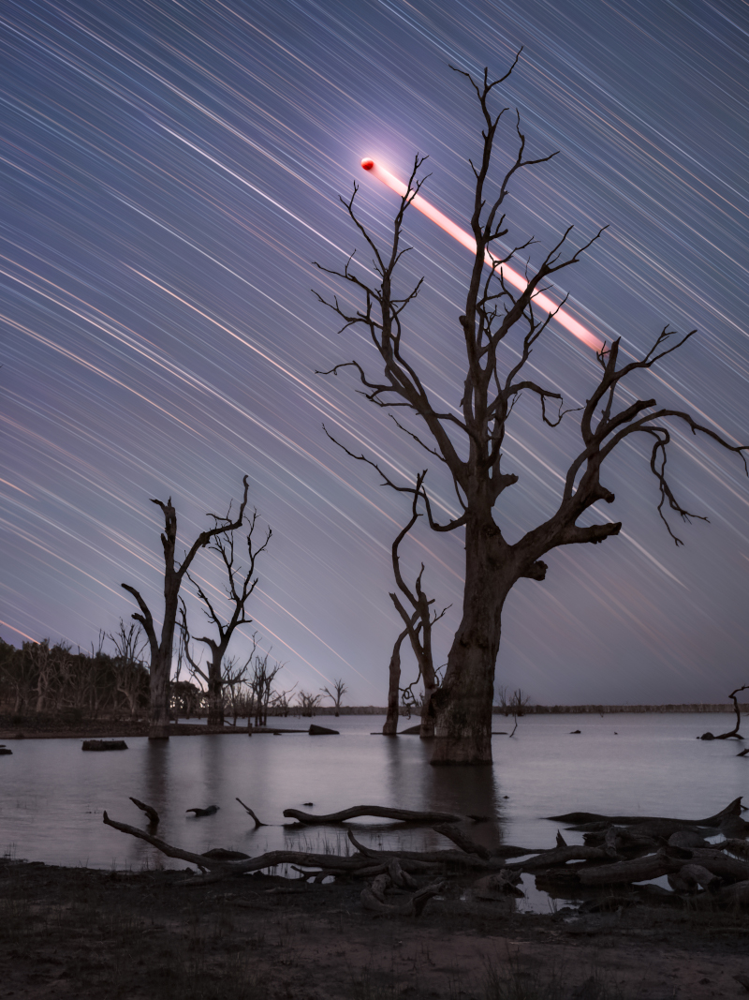

    #  NASA Astronomy Picture of the Day

    Date: 2026-03-13

     Toolondo Totality Trails

    
    In this composited night skyscape, stacked exposures trace graceful star trails above Lake Toolondo, Victoria, Australia, planet Earth. Captured while the lunar eclipse of March 3 was in progress, the exposures used were made during the hour-long total eclipse phase. So faint star trails are easily visible along with the trail of the reddened Moon in the eclipse-darkened skies above the lake and trees. Of course, the apparent motion of Moon and stars revealed in the timelapse composite reflect the Earth's daily rotation around its axis. Dramatically punctuating the Moon's trail as totality ended, a single, separate telephoto image of the totally eclipsed Moon was scaled and blended into the scene.   Growing Gallery: Total Lunar Eclipse of March 3

    Image credit: NASA APOD
        