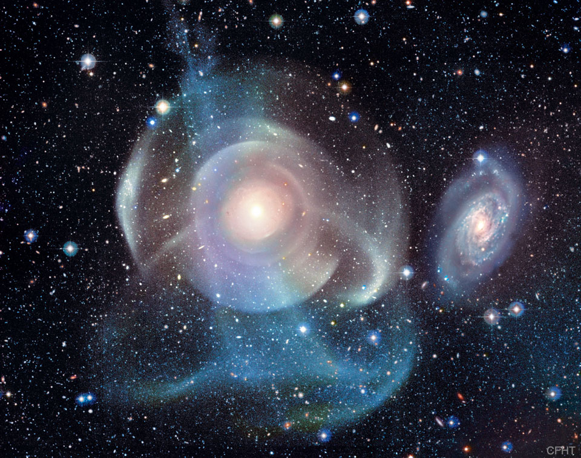

    #  NASA Astronomy Picture of the Day

    Date: 2026-07-12

     Galaxy NGC 474: Shells and Star Streams

    
    What's happening to galaxy NGC 474?  The multiple layers of emission appear strangely complex given the relatively featureless appearance of the elliptical galaxy in less deep images.  The cause of the shells is a topic of research, but they are possibly tidal tails related to debris left over from absorbing numerous small galaxies in the past billion years.  Alternatively, the shells may be like ripples in a pond, where the ongoing collision with the spiral galaxy just to the right of NGC 474 is causing density waves to ripple through the galactic giant.  Regardless of the actual cause, the featured image dramatically highlights the increasing evidence that the halos of some elliptical galaxies are surprisingly complicated.  Similarly, the halo of our own Milky Way Galaxy is one example of such unexpected intricacies.  NGC 474 spans about 250,000 light years and lies about 100 million light years distant toward the constellation of the Fish (Pisces).

    Image credit: NASA APOD
        