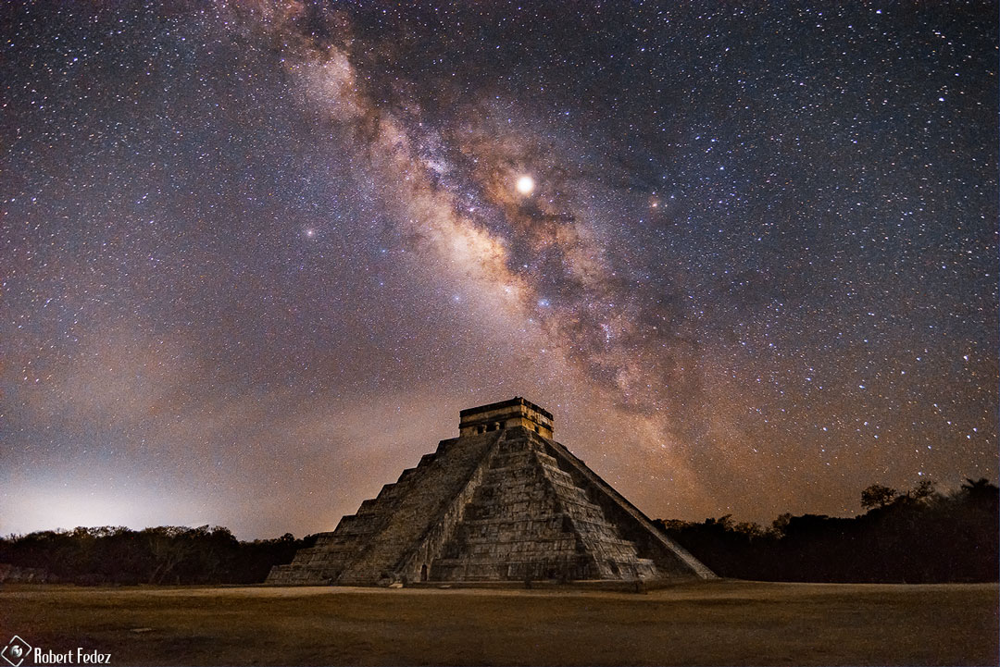

    #  NASA Astronomy Picture of the Day

    Date: 2026-03-15

     Equinox at the Pyramid of the Feathered Serpent

    
    To see the feathered serpent descend the Mayan pyramid requires exquisite timing.  You must visit El Castillo -- in Mexico's Yucatán Peninsula -- near an equinox.  Then, during the late afternoon if the sky is clear, the pyramid's own shadows create triangles that merge into the famous illusion of a slithering viper.  Also known as the Temple of Kukulkan, the impressive step-pyramid stands 30 meters tall and 55 meters wide at the base.  Built up as a series of square terraces by the pre-Columbian civilization between the 9th and 12th century, the structure can be used as a calendar and is noted for astronomical alignments. The featured composite image was captured in 2019 with Jupiter and Saturn straddling the diagonal central band of our Milky Way galaxy. In a few days another equinox will occur -- not only at Temple of Kukulcán, but all over planet Earth.

    Image credit: NASA APOD
        