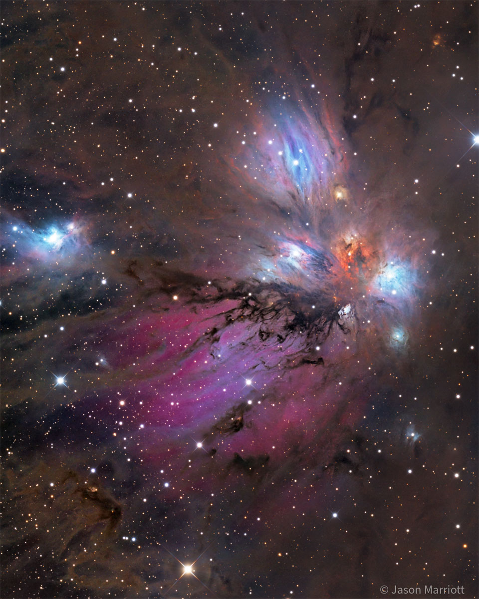

    #  NASA Astronomy Picture of the Day

    Date: 2026-05-19

     NGC 2170: The Angel Nebula

    
    Is this a painting or a photograph? In this celestial abstract art composed with a cosmic brush, dusty nebula NGC 2170, also known as the Angel Nebula, shines just above the image center. Reflecting the light of nearby hot stars, NGC 2170 is joined by other bluish reflection nebulae, a red emission region, many dark absorption nebulae, and a backdrop of colorful stars. Like the common household items that abstract painters often choose for their subjects, the clouds of gas, dust, and hot stars featured here are also commonly found in a setting like this one --  a massive, star-forming molecular cloud in the constellation of the Unicorn (Monoceros). The giant molecular cloud Mon R2, is impressively close, estimated to be only 2,400 light-years or so away. At that distance, this canvas would be over 60 light-years across.   Almost Hyperspace: Random APOD Generator

    Image credit: NASA APOD
        