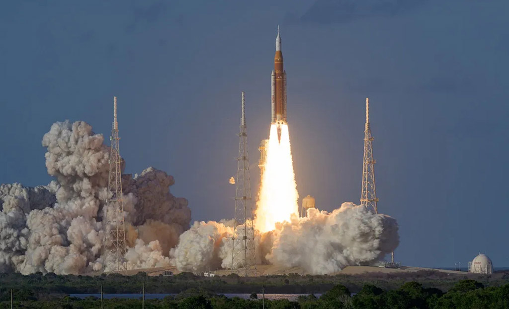

    #  NASA Astronomy Picture of the Day

    Date: 2026-04-02

     Liftoff! Returning to the Moon

    
    We are one small step closer to returning to the Moon. A new chapter in human exploration began yesterday when NASA's Artemis II launched aboard the Space Launch System (SLS) from Kennedy Space Center. Carrying four astronauts, the Orion spacecraft's planned lunar flyby will be the first in over half a century. This historic test flight, echoing the legacy of Apollo while pushing beyond it, will carry its crew farther from Earth than any humans since 1972, looping around the Moon before returning home. During the approximately ten-day journey, Orion's systems--from life support to navigation--will be tested in deep space, while astronauts observe the lunar surface, including shadowed regions of the far side rarely seen with such perspective. After looping around the Moon, the astronauts will return to Earth, ending their journey with a Pacific Ocean splashdown.

    Image credit: NASA APOD
        