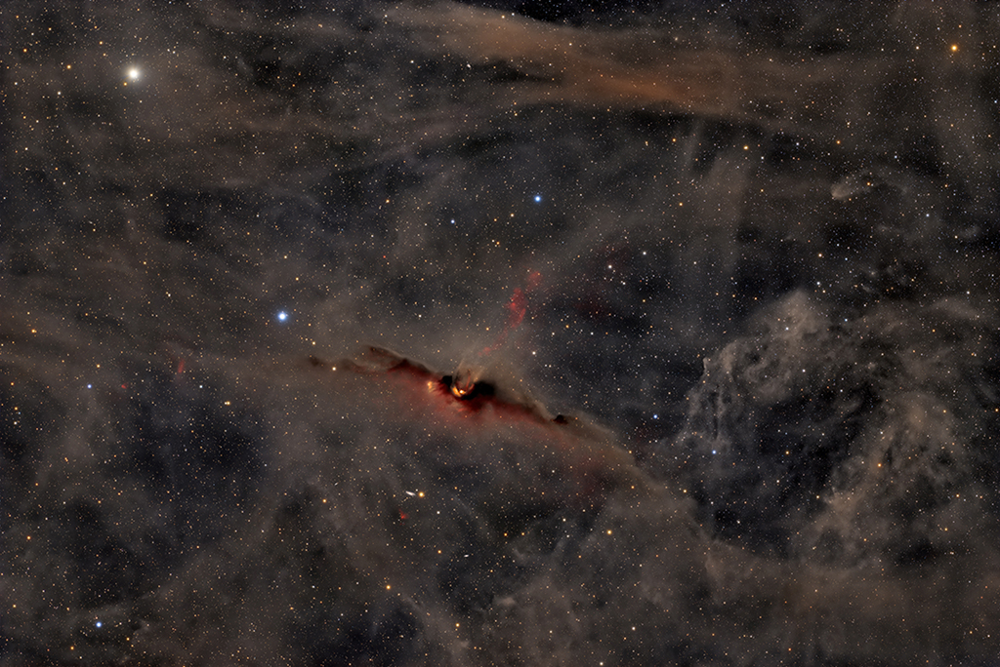

    #  NASA Astronomy Picture of the Day

    Date: 2026-07-09

     The Red Glow of the Cosmic Bat Nebula

    
    This Cosmic Bat wishes you a happy Summerween! This mid-year celebration of Halloween transcends hemispheres, even though summer in the Northern hemisphere is winter in the South. Contrary to its eery aura, the Cosmic Bat Nebula (LDN 43), not to be confused with the Bat Nebula (NGC 6995), is a vibrant birthplace for stars. A bit of young starlight peeks through the dense clouds of gas and dust that make up the Cosmic Bat’s 12 lightyear wingspan. The ultraviolet light from the young stars energizes the nebula’s hydrogen gas, causing it to glow an ominous red. The jet of glowing hydrogen gas emerging from the bat’s head hints at the star formation hidden within.

    Image credit: NASA APOD
        