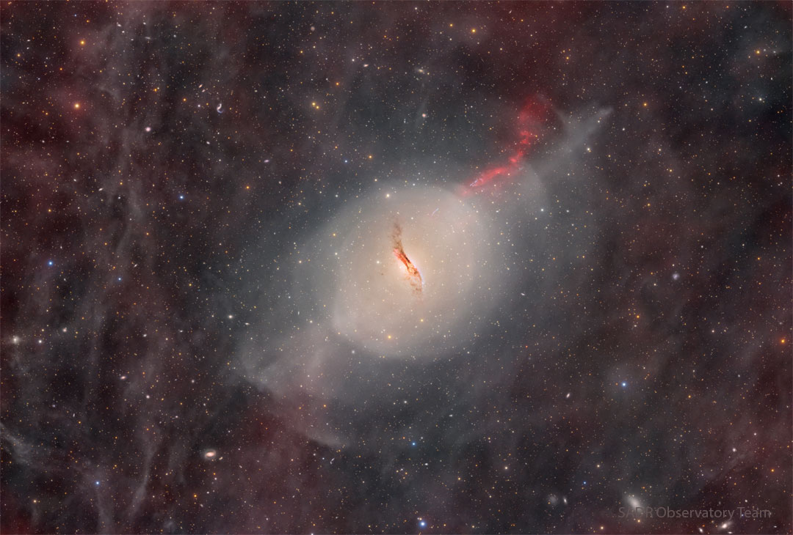

    #  NASA Astronomy Picture of the Day

    Date: 2026-03-30

     Peculiar Elliptical Galaxy Centaurus A

    
    What's happened to the center of this galaxy?  Dramatic dust lanes run across the center of unusual elliptical galaxy Centaurus A. These dust lanes are so thick they almost completely obscure the galaxy's center in visible light.  This is particularly unusual as Cen A's older stars and oval shape are characteristic of a giant elliptical galaxy, a galaxy type typically low in dark dust.  Pictured in this deep image is a complex network of foreground gas and dust, as well as shells of dim stars and a jet projecting to the upper right.  Also known as NGC 5128, Cen A is surely the result of a galactic collision where many young dust-creating stars were formed.  However, details of the creation of Cen A's unusually active center and iconic central dust lanes are still being researched.  Cen A lies only 13 million light years away, making it the closest active galaxy.    Jigsaw Galaxy: Astronomy Puzzle of the Day

    Image credit: NASA APOD
        