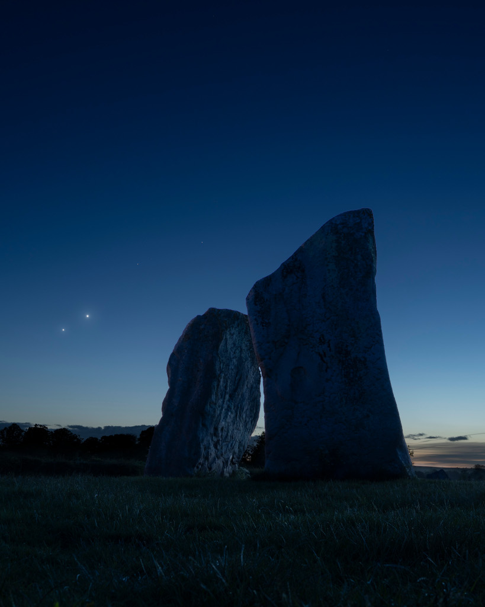

    #  NASA Astronomy Picture of the Day

    Date: 2026-06-12

     Venus and Jupiter: Conjunction from Avebury

    
    To see Venus and Jupiter together this month, you won't need binoculars or even a telescope. Just look up after sunset and you'll find them emerging as the sky grows dark near the western horizon. In fact, on June 9 the two brightest planets were in close conjunction, separated on the sky by less than 2 degrees from our perspective. Since (brighter) inner planet Venus orbits the Sun faster than outer planet Jupiter, it catches up with and passes the outer planet along the ecliptic roughly every 13 months. But every three years or so their resulting conjunction can be viewed far enough from the Sun to be easily seen in Earth's twilight skies. On June 9, the two celestial beacon's close "cosmic kiss" was captured here next to the two large standing stones at the cove within a 4,000 year old stone circle at Avebury, UK. Larger than Stonehenge, the Avebury henge and stone circle complex is also recognized as one of the most significant neolithic ceremonial sites on planet Earth.

    Image credit: NASA APOD
        