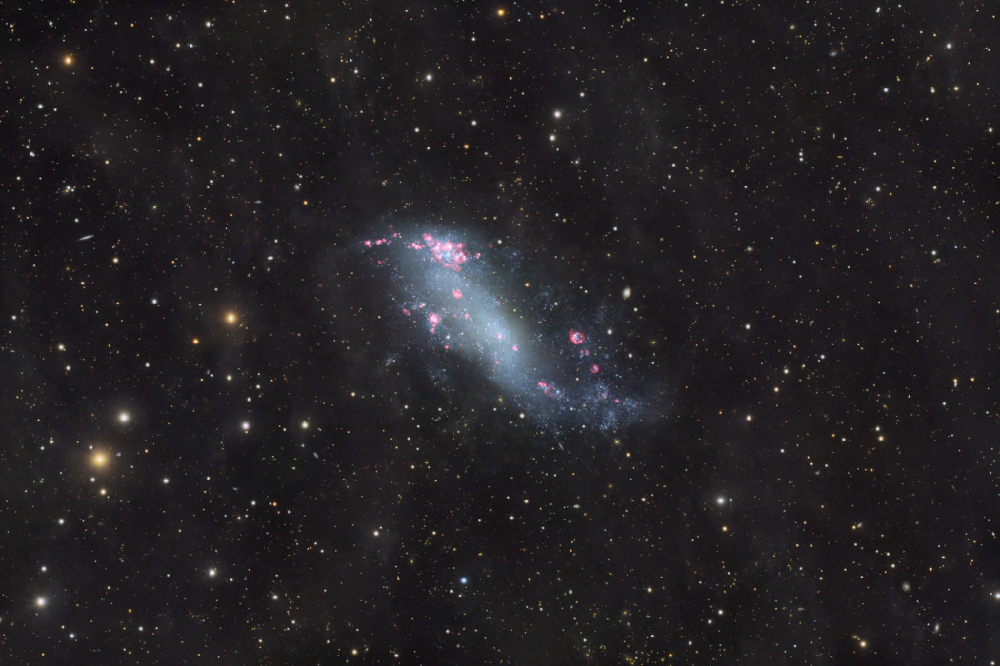

    #  NASA Astronomy Picture of the Day

    Date: 2026-02-19

     IC 2574: Coddington's Nebula

    
    Grand spiral galaxies often seem to get all the glory, flaunting their young, bright, blue star clusters in beautiful, symmetric spiral arms. But small, irregular galaxies form stars too. In fact, dwarf galaxy IC 2574 shows clear evidence of intense star forming activity in its telltale reddish regions of glowing hydrogen gas. Just as in spiral galaxies, the turbulent star-forming regions in IC 2574 are churned by stellar winds and supernova explosions spewing material into the galaxy's interstellar medium and triggering further star formation. A mere 12 million light-years distant, IC 2574 is part of the M81 group of galaxies, seen toward the northern constellation Ursa Major. Also known as Coddington's Nebula, the faint but intriguing island universe is about 50,000 light-years across, discovered by American astronomer Edwin Coddington in 1898.

    Image credit: NASA APOD
        