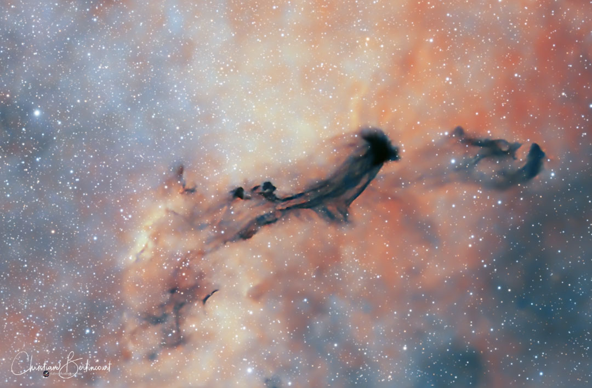

    #  NASA Astronomy Picture of the Day

    Date: 2026-02-20

     B93: A Dark Interstellar Ghost

    
    "A ghost in the Milky Way…” says Christian Bertincourt, the astrophotographer behind this striking image of Barnard 93 (B93).  The 93rd entry in Barnard’s Catalogue of Dark Nebulae, B93 lies within the Small Sagittarius Star Cloud (Messier 24), where its darkness stands in stark contrast to bright stars and gas in the background.  In some ways, B93 is really like a ghost, because it contains gas and dust that was dispersed by the deaths of stars, like supernovas.  B93 appears as a dark void not because it is empty, but because its dust blocks the light emitted by more distant stars and glowing gas.  Like other dark nebulas, some gas from B93, if dense and massive enough, will eventually gravitationally condense to form new stars.  If so, then once these stars ignite, B93 will transform from a dark ghost into a brilliant cradle of newborn stars.

    Image credit: NASA APOD
        