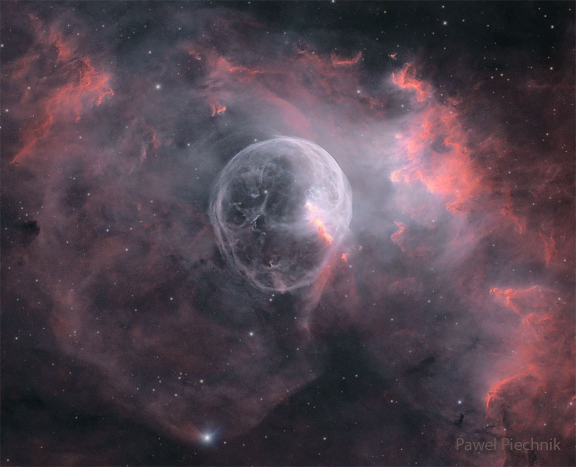

    #  NASA Astronomy Picture of the Day

    Date: 2026-07-27

     NGC 7635: The Bubble Nebula

    
    What created this huge space bubble? Blown by the wind from a star, this tantalizing, head-like apparition is cataloged as NGC 7635, but known simply as the Bubble Nebula. Taken from Krakow, Poland, the featured view utilizes a long exposure to reveal the intricate details of this cosmic bubble and its environment. Although it looks delicate, the 10 light-year diameter bubble offers evidence of violent processes at work. Seen here right of the Bubble's center, a bright hot star is embedded in the nebula's reflecting dust. A fierce stellar wind and intense radiation from the star, which likely has a mass 10 to 20 times that of the Sun, has blasted out the structure of glowing gas against denser material in a surrounding molecular cloud. The intriguing Bubble Nebula lies a mere 11,000 light-years away toward the boastful constellation Cassiopeia.

    Image credit: NASA APOD
        