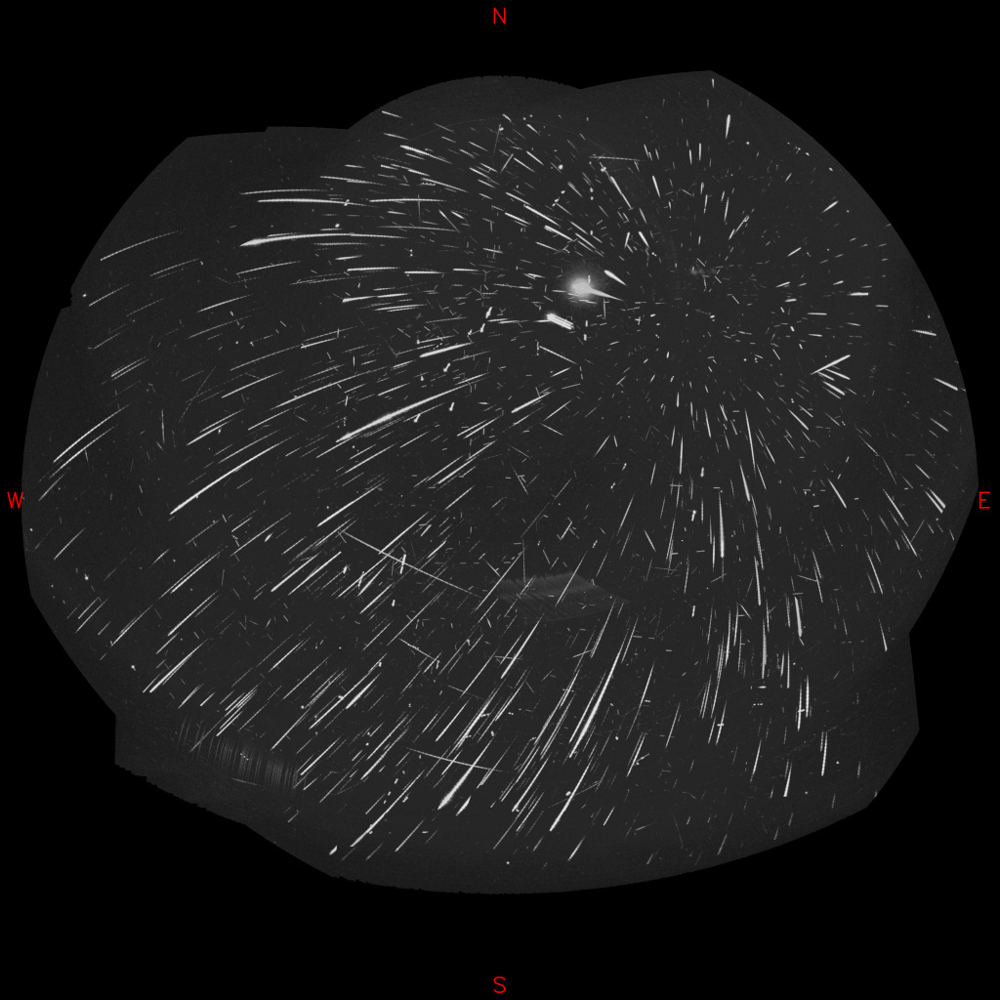

    #  NASA Astronomy Picture of the Day

    Date: 2026-08-22

     Mostly Perseids

    
    Recorded the night of August 12-13, images from four dedicated meteor-monitoring cameras at an astronomical observatory in Czechia were aligned and combined to create this all-night, all-sky view. On that night, the total count came to 1,706 meteors. And since that coincided with the peak activity of the 2026 Perseid Meteor Shower, most are perseids. Their overwhelming numbers make them easy to spot. Quite convincingly, perseid trails all trace back to a single radiant on the sky at the upper right, a region in the annual shower's eponymous constellation Perseus. But meteors belonging to other much less active showers can also revealed by finding their radiants too. For example, seen crossing the perseid trails are meteors from a shower whose radiant lies in Cygnus, known as Kappa Cygnids. The antihelion complex, a general region near Aquarius and opposite the Sun in the sky, is also identifiable as a weak source for meteors.

    Image credit: NASA APOD
        