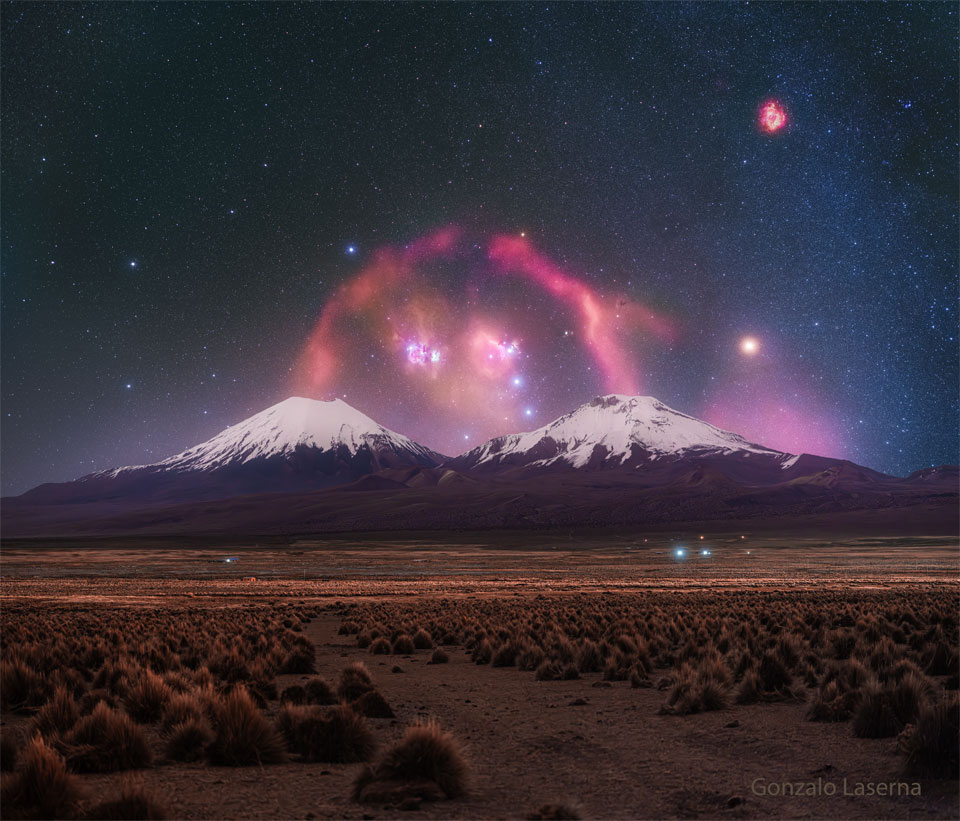

    #  NASA Astronomy Picture of the Day

    Date: 2026-07-28

     Barnards Loop over Twin Volcanoes

    
    What's connecting these two volcanoes? In ancient folklore, the two volcanoes, Parinacota (left) and Pomerape (right), are connected by representing a mythical prince and princess who engaged in a forbidden romance.  Beneath the ground, the two peaks are not known to be connected by a common pool of hot magma, and neither volcano has erupted in the past 1000 years.  Above the ground, there is usually nothing in the sky that connects them -- except if you use careful timing and look from a specific location.  The featured well-planned image was captured from Bolivia in mid-April with a series of camera exposures taken on the same day and from the same location.  Then, Barnard's Loop appeared to connect the volcanic peaks. Also visible in the image is the Orion Nebula in the center, the star Betelgeuse on the right, and the Rosette Nebula on the upper right.    Sky Surprise: What picture did APOD feature on your birthday? (after 1995)

    Image credit: NASA APOD
        